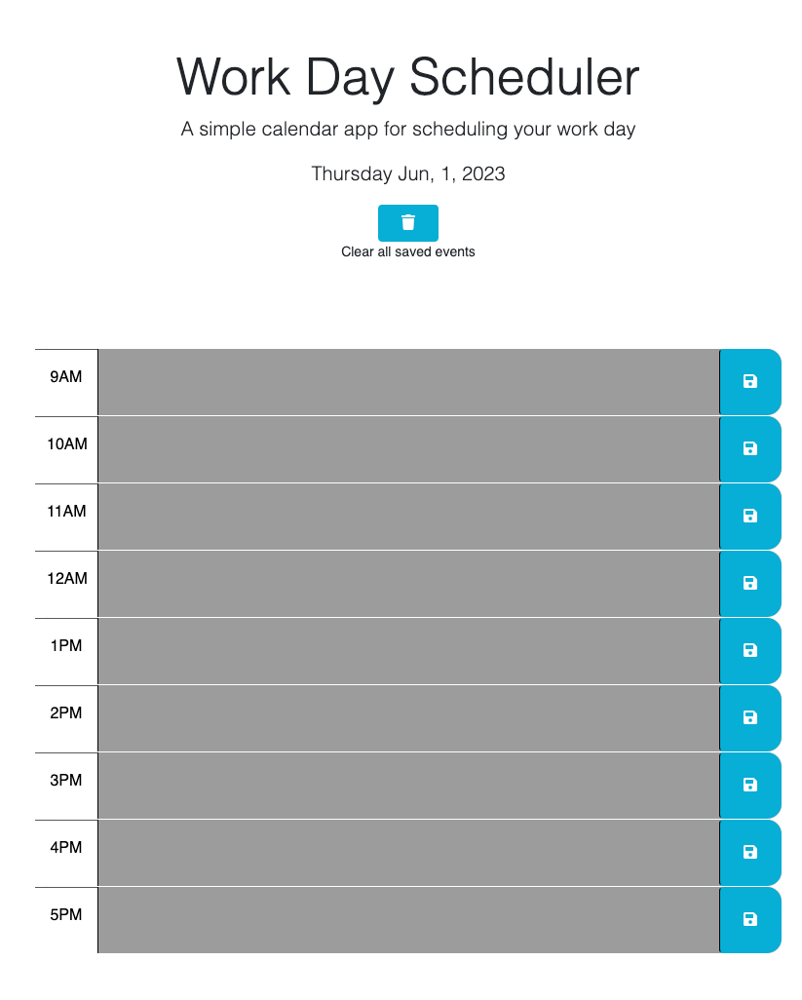

# Taylor's Work Day Scheduler

## Desription

-As a user I want a simple daily scheduling app that shows me the day, lets me add events and gives me feedback as to which part of the day it is currently.  When I save an event I want it to be held in local storage so I can leave the page and upon return my events will still be there

-I went a little above the requirments with this and added a feature that briefly tells the user that an event was added, and I added a clear all events button just so on a new day you could start fresh.

-This was built with starter code from Xandromus, which included HTML, CSS and a mostly blank Javascript file

-The first thing I added was the $(document).ready(function ()) to make sure that all the DOM elements were rendered before running the script

-Next I built out more of the HTML to create all of the rows that represent the hours from 9am-5pm

-Then I added the date to the page via day.js

-From here I built out the rest of the function using bits of jquery to get and append DOM elements, a conditional statement that determines how each element is styled in relation to the current time and event listners and local storage to handle the save button.

-After all of this I felt like the app needed more functionality so made it so when you had saved an item a brief message would apper on screen and tell the user that they had added an event to storage. As well as a clear all events button that would clear all descriptions and local storage.

## Acceptence requirments:

GIVEN I am using a daily planner to create a schedule

WHEN I open the planner
THEN the current day is displayed at the top of the calendar✅

WHEN I scroll down
THEN I am presented with time blocks for standard business hours of 9am to 
5pm✅

WHEN I view the time blocks for that day
THEN each time block is color-coded to indicate whether it is in the past, present, or future✅

WHEN I click into a time block
THEN I can enter an event✅

WHEN I click the save button for that time block
THEN the text for that event is saved in local storage✅

WHEN I refresh the page
THEN the saved events persist✅

## Installation

follow this link to checkout the finished page https://taylorgehrts.github.io/Taylors_Calander_app/

## Usage

-To use the app simply enter the event in the corresponding time block and hit the save button when you are ready to commit the event.

-To change an event simply delete the previous event and put in a new one or append the existing event and hit save.

-When the hour has already past time blocks will be styled in grey, when in the current hour it will be styled red, and when in the future it will be styled green.

-To clear all events simply hit the clear button

-Have fun and stay on schedule

## ScreenShots

## Credits
Starter code - Xandromus https://github.com/coding-boot-camp/crispy-octo-meme

Mdn and w3schools - technical resource

StackOverflow - technical resources

